# Hexo搭建Github静态博客

## 1.下载安装Git

1.1 Git下载地址： https://gitforwindows.org/ 

1.1.1 淘宝镜像下载Git：https://registry.npmmirror.com/binary.html?path=git-for-windows/

1.2 安装步骤: **一路默认安装**

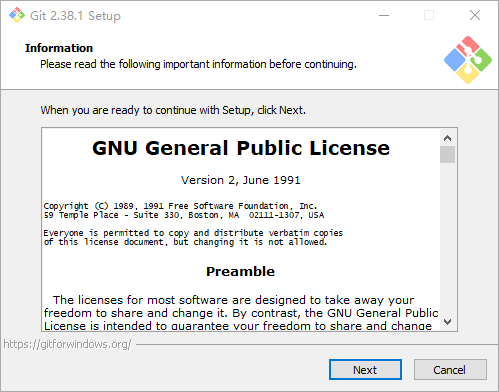

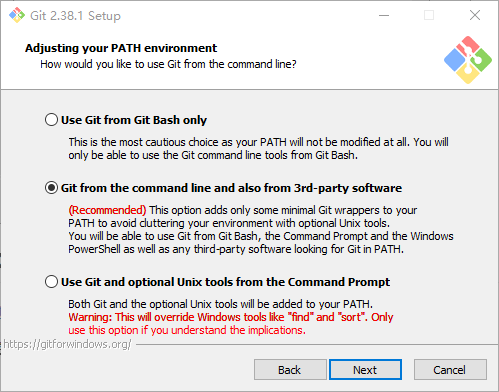

## 2.下载安装node.js

2.1 node.js下载地址：https://nodejs.org/en/

2.2 安装步骤：一路默认安装

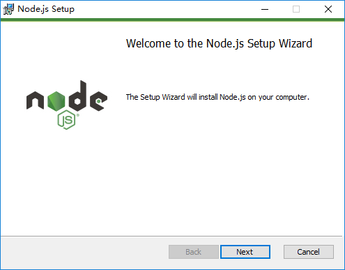

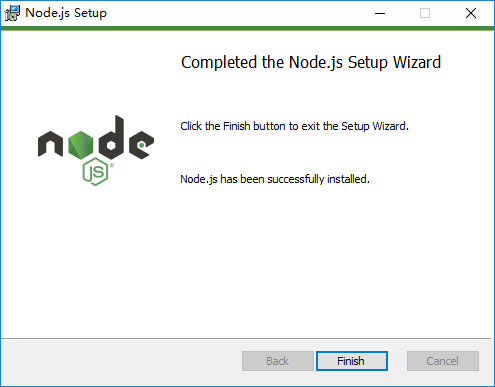

## 3.安装Hexo

3.1 利用npm命令，使用Git Bash安装hexo

3.2 输入命令：npm install -g hexo

> $ npm install -g hexo

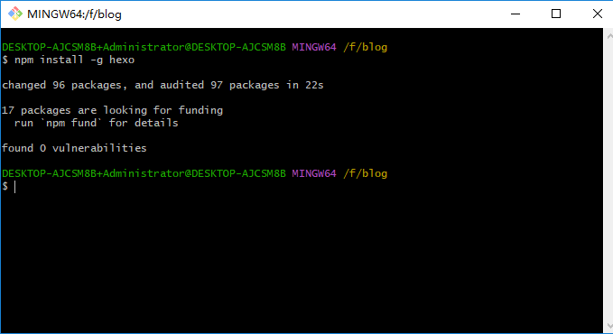

## 4.初始化Hexo

4.1 使用命令在F盘下创建blog博客目录

4.2 切换到blog目录创建hexo文件夹

> $ mkdir hexo

4.3 在Hexo文件夹下输入命令：hexo init （初始化hexo）

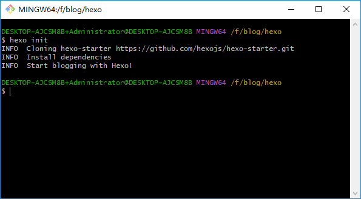

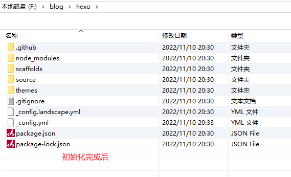

4.4 修改Hexo目录下的配置文件_config.yml,进行基础配置

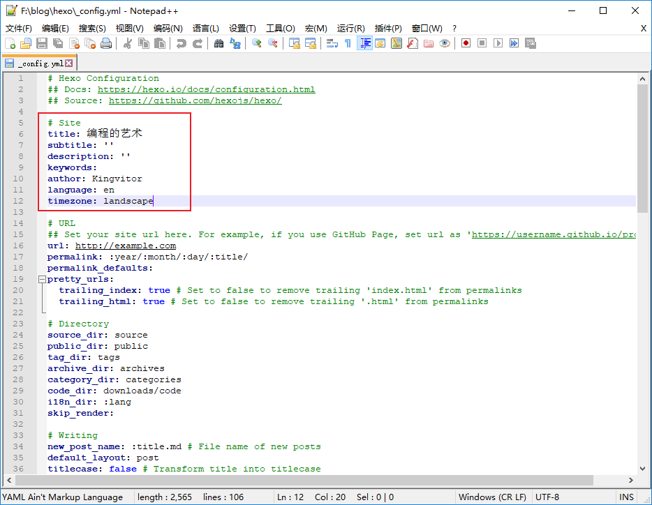

4.5 hexo可用的主题浏览（https://hexo.io/themes/），选择自己喜欢的博客主题：例如使用（hexo-theme-matery）主题

在Hexo文件夹下Git Bash

输入命令：cd themes

输入命令: mkdir hexo-theme-matery

输入命令: cd hexo-theme-matery

输入命令：git clone https://github.com/blinkfox/hexo-theme-matery.git

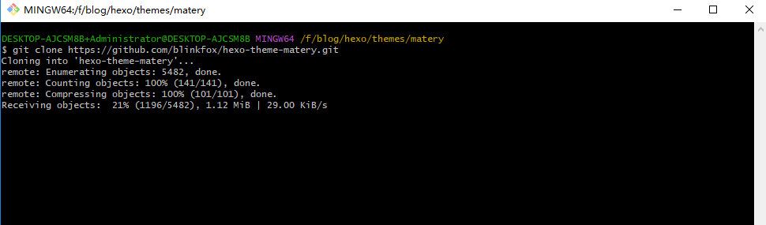

注：如果localhost:4000浏览出现（原因是[hexo](https://so.csdn.net/so/search?q=hexo&spm=1001.2101.3001.7020)在5.0之后把swig给删除了需要自己手动安装）

**出现问题**

**解决方法**

>npm i hexo-renderer-swig

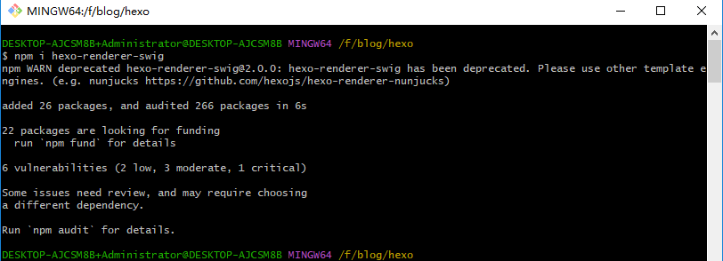

4.6 修改配置文件：修改主题名称

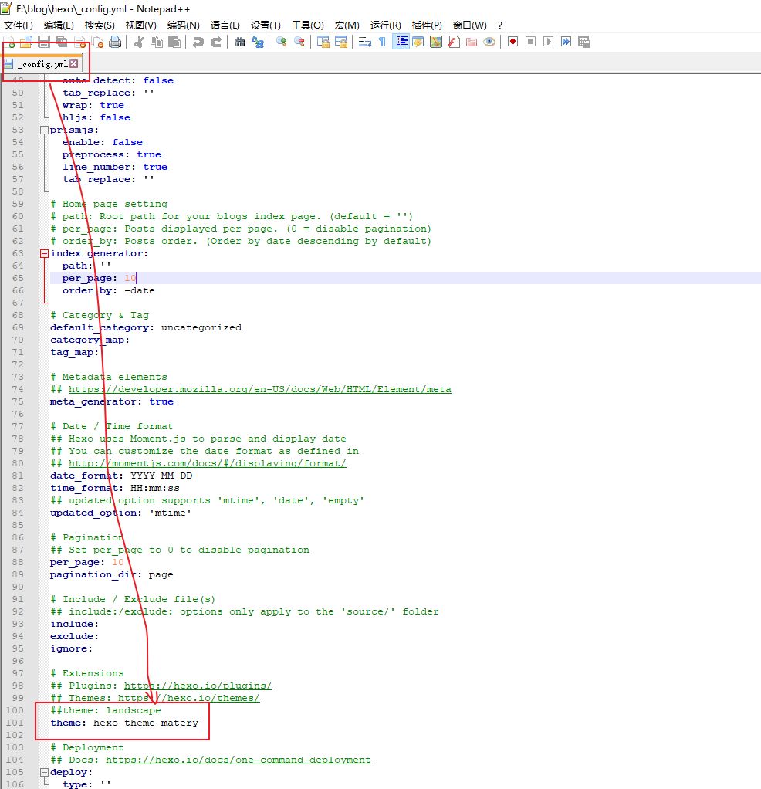

4.6 本地浏览博客：

4.6.1 输入hexo clean & hexo g & hexo s 组合命令

> hexo clean & hexo g & hexo s

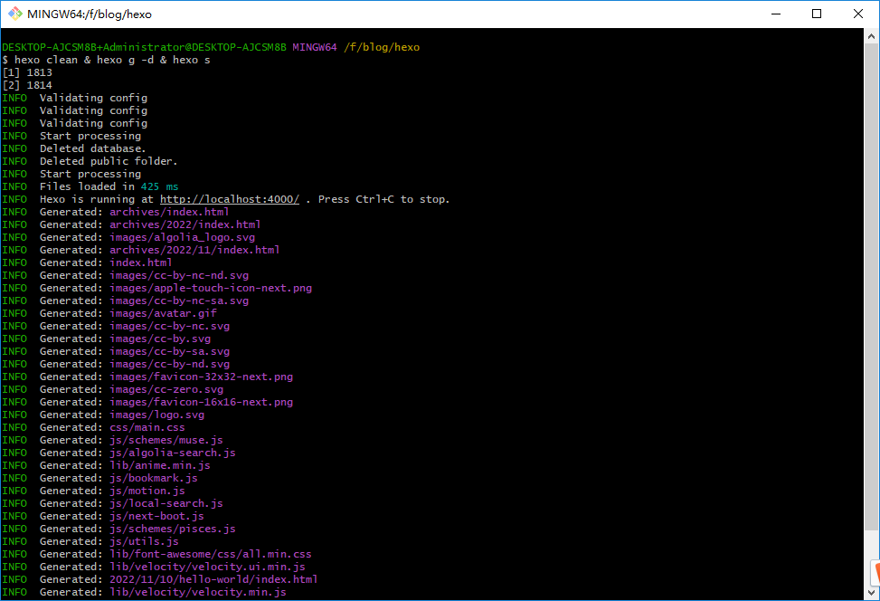

4.6.3 在浏览器输入：localhost:4000

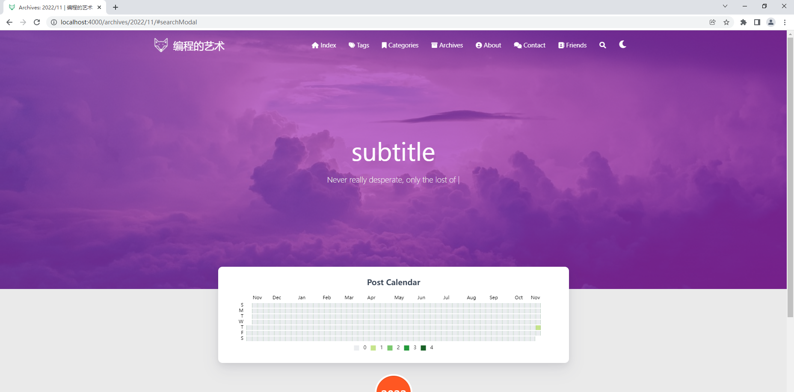

## 5.部署到Github上

5.1 申请Github账号

5.2 创建一个新的仓库：

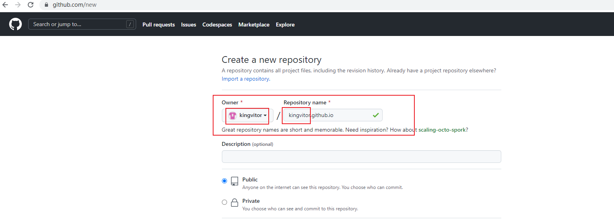

5.3 配置仓库地址：

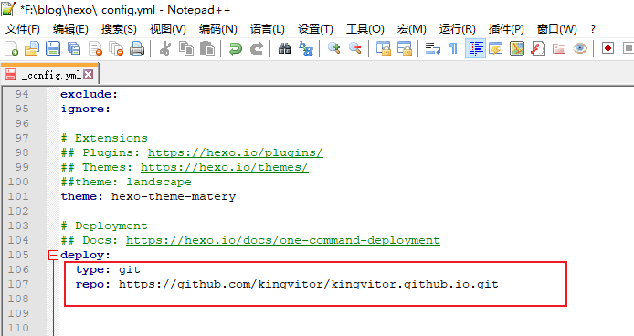

5.4 安装hexo-deployer-git自动部署发布工具

> npm install hexo-deployer-git --save

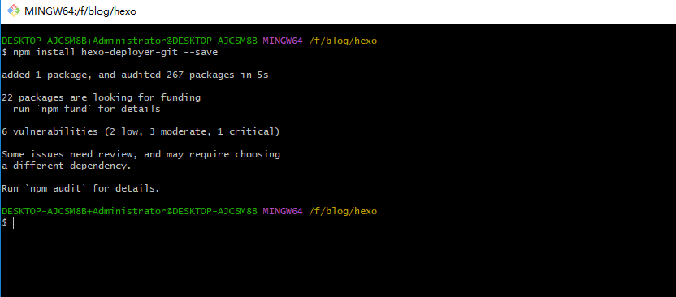

5.5 发布到Github

> hexo clean && hexo g && hexo d

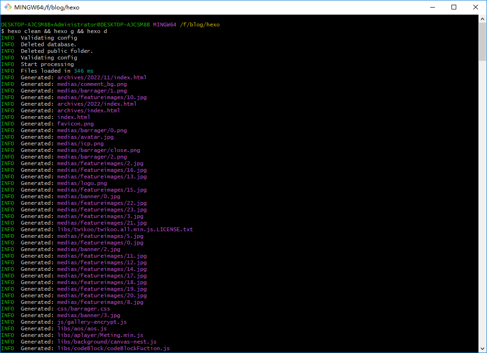

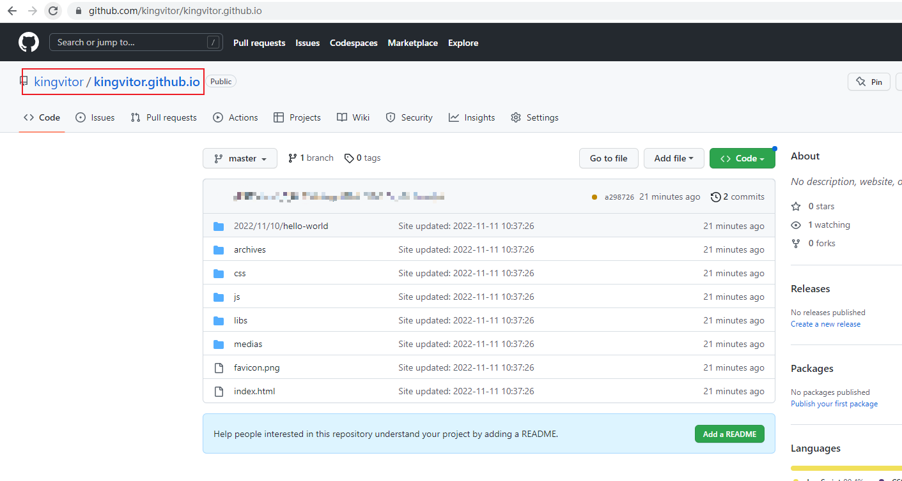

5.6 测试访问：https://kingvitor.github.io/

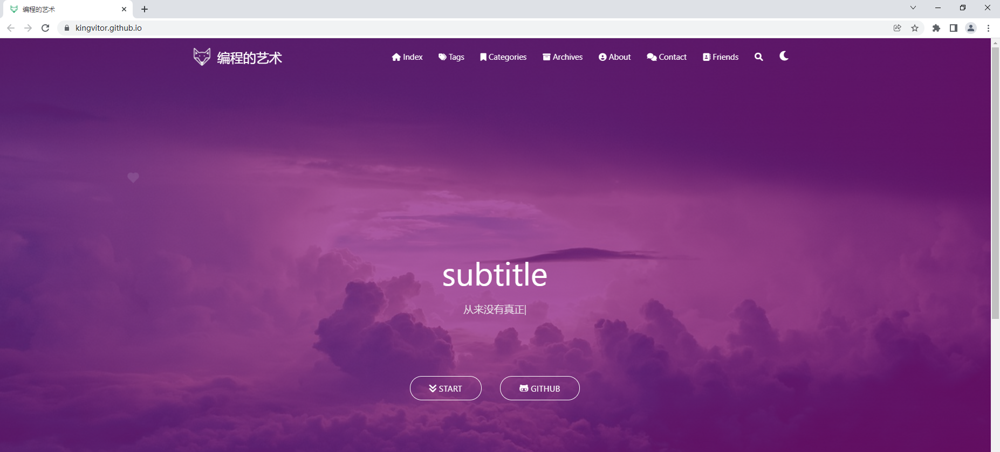

## 6 搭建过程问题解决

### 6.1浏览 localhost:4000出现文本

（原因是[hexo](https://so.csdn.net/so/search?q=hexo&spm=1001.2101.3001.7020)在5.0之后把swig给删除了需要自己手动安装）

**问题现象**

**解决方法**

>npm i hexo-renderer-swig

### 6.2 Markdown 上的本地图片无法显示

图片的相对路径问题

**图片路径问题**：图片不显示

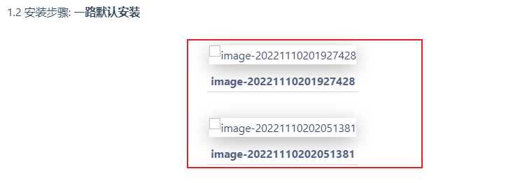

**问题解决**

1、安装npm i hexo-renderer-marked

> npm i hexo-renderer-marked

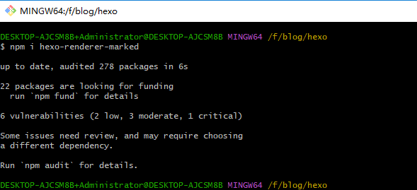

2、在自己的博客source路径下新建文件夹images文件夹

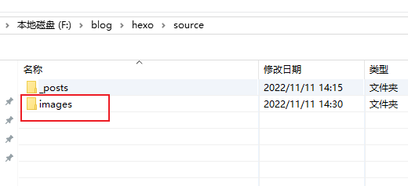

3、在typora(Markdown编辑器),进入到 文件–>偏好设置–>图像，然后选择复制到指定路径，选到上面新建的images文件夹路径，勾选下面红框的选项

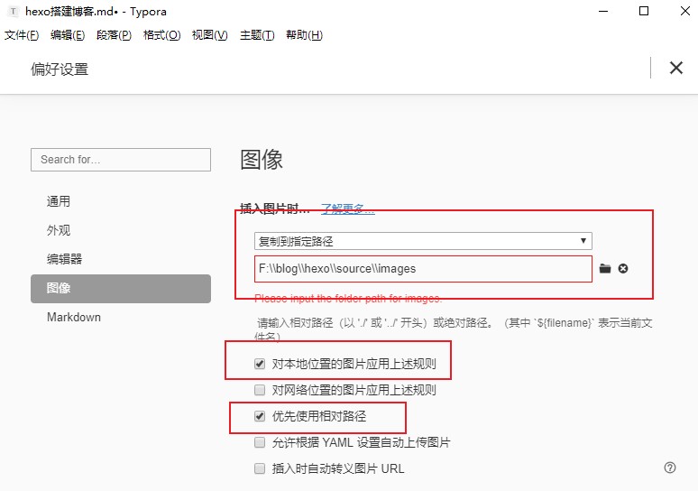

4、修改配置文件**_config.yml**

4.1 修改：

> post_asset_folder: true

4.2 添加下面配置：

>  marked:
>
> ​		prependRoot: true
>
> ​		postAsset: true

完成以上步骤，每次复制的图片就是相对路径的了	

